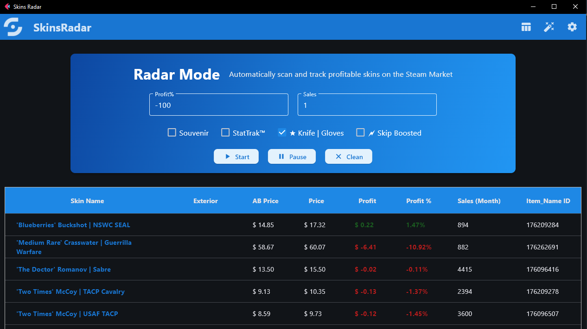

# SkinsRadar


SkinsRadar is a powerful **CS2 skins monitoring tool** for [steamcommunity.com](https://steamcommunity.com) 🚀. It helps you track and analyze skin prices, bypass Steam's request limits using proxies, and find profitable deals for trading or other purposes. **No account registration or login required** 🔑—dive right in!

With two core modes—**Radar Mode** ⚡ for rapid scanning of all CS2 items and **Browser Mode** 📊 for detailed exploration of specific items—SkinsRadar is perfect for active skin traders, buyers, or anyone looking to navigate Steam's marketplace without restrictions.

## ✨ Features

- **Radar Mode** ⚡:
  - Scan all CS2 skins and items to find profitable deals based on customizable parameters:
    - 💰 Profit percentage (with Steam's commission, default 13.0%).
    - 📈 Monthly sales volume.
    - 🗂️ Filter by item groups (e.g., Souvenir, StatTrak™, ★ Knife | Gloves).
    - 🗲 Skip boosted items with a configurable boost percentage (default 30.0%).
- **Browser Mode** 📊:
  - Browse over **23,000 CS2 items** with detailed listings:
    - 🔍 View all lots, including stickers and charms for skins.
    - 🎨 Filter by Exterior (wear), number of lots (Amount), and currency.
    - 💸 Instantly see profit percentage compared to the Autobuy price.
- **Proxy Management** 🌐:
  - Add proxies via text files, stored in a database with rotation to bypass Steam's request limits.
- **Multi-Currency Support** 💱:
  - Supports ~40 Steam-supported currencies in Browser Mode; Radar Mode uses USD.
- **Settings** ⚙️:
  - 💸 Customize Steam commission (default 13.0%).
  - 🗲 Set maximum boost percentage (default 30.0%).
  - 📂 Add proxies via file explorer (`Update Proxy` button).
  - 🗑️ Clear proxy database (`Wipe Proxies Database` button).
  - 🗄️ Update or rebuild the CS2 items database (`Update Skins Database` button).
  - 🌙 Switch between Dark and Light themes (defaults to system theme).
- **No Registration Required** 🔓:
  - Access all features without needing a Steam account or API key.
- **Logging** 📜:
  - Configurable logging for debugging with language (`--lang=ru` or `--lang=en`) and log level options (`DEBUG`, `INFO`, etc.).

## 🛠️ Installation

SkinsRadar requires **Python 3.12** for optimal performance (other versions are not tested) 🐍.

1. **Clone the repository**:
   ```bash
   git clone https://github.com/Max2772/SkinsRadar.git
   cd SkinsRadar
   ```
2. **Install dependencies**:
   ```bash
   pip install -r requirements.txt
   ```
3. **Configure proxies** (optional) 🌐:
   - Use the `Update Proxy` button to add proxies via a text file.
   - The app automatically filters working proxies and avoids duplicates.
4. **Initialize the skins database** (optional) 🗄️:
   - Use the `Update Skins Database` button to create or update the CS2 items database.

> **Note**: Pre-built binaries for **Windows** and **Linux** are available in the `build/` directory 📦.

### Dependencies 📋
- Python 3.12
- `flet==0.28.3`
- `httpx==0.28.1`
- `httpx_socks==0.10.1`
- `aiosqlite==0.21.0`
- `aiofiles==24.1.0`
- `tqdm==4.67.1`
- `fuzzywuzzy==0.18.0`
- `python-Levenshtein==0.27.1`

See `requirements.txt` for the full list.

## 🚀 Usage

### Running the Application
- **Via Python**:
  ```bash
  python3 main.py
  ```
  Optional arguments:
  - `--lang=ru` or `--lang=en`: Set the terminal logger language (Russian or English).
  - `--log-level=DEBUG|INFO|WARNING|WARN|ERROR|FATAL|CRITICAL`: Configure the logging level.

- **Via Pre-built Binaries**:
  - Use the executables in the `build/` directory for Windows or Linux.

### Example Workflow
1. **Launch the app**:
   ```bash
   python3 main.py --lang=en --log-level=INFO
   ```
2. **Radar Mode** ⚡:
   - Set profit percentage, sales volume, and item groups.
   - Enable 🗲 Skip Boosted to filter out boosted items (default 30.0%).
   - Scan for profitable CS2 items.
3. **Browser Mode** 📊:
   - Select an item from 23,000+ CS2 items.
   - Filter by Exterior, Amount, and Currency.
   - View profit percentages and lot details (stickers, charms).
4. **Settings** ⚙️:
   - Adjust Steam commission or theme.
   - Add proxies via `Update Proxy` or rebuild the database with `Update Skins Database`.

## 📸 Screenshots and Logs

### Screenshots 🖼️
Below are placeholders for the main windows of SkinsRadar. Replace these with actual screenshots by updating the image paths.

- **Browser Mode**:
  
  *Explore detailed listings for over 23,000 CS2 items with filters for Exterior, Amount, and Currency.*

- **Radar Mode**:
  
  *Rapidly scan all CS2 items to find profitable deals with customizable filters.*

- **Settings**:
  
  *Customize Steam commission, proxy settings, database updates, and app theme.*

> **Note**: To add screenshots, place the image files (e.g., `browser_mode.png`, `radar_mode.png`, `settings.png`) in the `assets/screenshots/` directory and update the paths above.

### Example Logs 📜
SkinsRadar provides detailed logging for debugging and monitoring. Below are example logs for **Browser Mode** and **Radar Mode**.

#### Browser Mode Logs
```log
2025-07-22 16:00:10,809 - [MainProcess] INFO - main.fetch_market_data:103 - Request for https://steamcommunity.com/market/listings/730/AK-47%20%7C%20Asiimov%20(Minimal Wear)/render?start=0&count=10&currency=1&format=json
2025-07-22 16:00:16,354 - [MainProcess] INFO - main.fetch_market_data:106 - Successful response from https://steamcommunity.com/market/listings/730/AK-47%20%7C%20Asiimov%20(Minimal Wear)/render?start=0&count=10&currency=1&format=json
2025-07-22 16:00:17,104 - [MainProcess] INFO - main.get_autobuy_data:52 - Request for https://steamcommunity.com/market/itemordershistogram?norender=1&country=NL&language=english&currency=1&item_nameid=176024804&two_factor=0
2025-07-22 16:00:17,104 - [MainProcess] INFO - main.get_autobuy_data:54 - Successful response for https://steamcommunity.com/market/itemordershistogram?norender=1&country=NL&language=english&currency=1&item_nameid=176024804&two_factor=0
```

#### Radar Mode Logs
```log
2025-07-22 16:03:23,022 - [MainProcess] INFO - handlers.start_parsing:242 - Radar Mode started
2025-07-22 16:03:23,026 - [MainProcess] INFO - proxies_manager.get_random_proxy:102 - Selected random proxy: socks4://98.175.31.195:4145
2025-07-22 16:03:23,033 - [MainProcess] INFO - skins_manager.get_item_autosearch:147 - Selected item: name=AK-47 | Baroque Purple (Minimal Wear), item_nameid=176096521
2025-07-22 16:03:24,804 - [MainProcess] INFO - main.get_autobuy_data:52 - Request for https://steamcommunity.com/market/itemordershistogram?norender=1&country=NL&language=english&currency=1&item_nameid=176096521&two_factor=0
2025-07-22 16:03:24,804 - [MainProcess] INFO - main.get_autobuy_data:54 - Successful response for https://steamcommunity.com/market/itemordershistogram?norender=1&country=NL&language=english&currency=1&item_nameid=176096521&two_factor=0
2025-07-22 16:03:26,027 - [MainProcess] INFO - main.get_history_data:76

 - Request for https://steamcommunity.com/market/listings/730/AK-47 | Baroque Purple (Minimal Wear)
2025-07-22 16:03:26,027 - [MainProcess] INFO - main.get_history_data:78 - Successful response for https://steamcommunity.com/market/listings/730/AK-47 | Baroque Purple (Minimal Wear)
2025-07-22 16:03:26,032 - [MainProcess] INFO - main
.get_history_data:81 - Item skipped because boosted
2025-07-22 16:03:26,032 - [MainProcess] INFO - handlers.start_parsing:273 - Item not added to AutoTable because it is boosted
2025-07-22 16:03:27,042 - [MainProcess] INFO - skins_manager.get_item_autosearch:147 - Selected item: name=AK-47 | Baroque Purple (Well-Worn), item_nameid=176096413
2025-07-22 16:03:27,790 - [MainProcess] INFO - main.get_autobuy_data:52 - Request for https://steamcommunity.com/market/itemordershistogram?norender=1&country=NL&language=english&currency=1&item_nameid=176096413&two_factor=0
2025-07-22 16:03:27,790 - [MainProcess] INFO - main.get_autobuy_data:54 - Successful response for https://steamcommunity.com/market/itemordershistogram?norender=1&country=NL&language=english&currency=1&item_nameid=176096413&two_factor=0
2025-07-22 16:03:28,875 - [MainProcess] INFO - main.get_history_data:76 - Request for https://steamcommunity.com/market/listings/730/AK-47 | Baroque Purple (Well-Worn)
2025-07-22 16:03:28,875 - [MainProcess] INFO - main.get_history_data:78 - Successful response for https://steamcommunity.com/market/listings/730/AK-47 | Baroque Purple (Well-Worn)
2025-07-22 16:03:28,878 - [MainProcess] INFO - main.process_autosearch_json_to_data:227 - Difference -12.535380507343131% < 5.0% item skipped
2025-07-22 16:03:28,879 - [MainProcess] INFO - handlers.start_parsing:271 - Item not added to AutoTable due to filtering
2025-07-22 16:03:29,882 - [MainProcess] INFO - skins_manager.get_item_autosearch:147 - Selected item: name=AK-47 | Black Laminate (Battle-Scarred), item_nameid=1321650
2025-07-22 16:03:30,653 - [MainProcess] INFO - main.get_autobuy_data:52 - Request for https://steamcommunity.com/market/itemordershistogram?norender=1&country=NL&language=english&currency=1&item_nameid=1321650&two_factor=0
2025-07-22 16:03:30,654 - [MainProcess] INFO - main.get_autobuy_data:54 - Successful response for https://steamcommunity.com/market/itemordershistogram?norender=1&country=NL&language=english&currency=1&item_nameid=1321650&two_factor=0
2025-07-22 16:03:32,060 - [MainProcess] INFO - main.get_history_data:76 - Request for https://steamcommunity.com/market/listings/730/AK-47 | Black Laminate (Battle-Scarred)
2025-07-22 16:03:32,060 - [MainProcess] INFO - main.get_history_data:78 - Successful response for https://steamcommunity.com/market/listings/730/AK-47 | Black Laminate (Battle-Scarred)
2025-07-22 16:03:32,066 - [MainProcess] INFO - handlers.start_parsing:276 - New row added to AutoTable
2025-07-22 16:03:33,082 - [MainProcess] INFO - skins_manager.get_item_autosearch:147 - Selected item: name=AK-47 | Black Laminate (Factory New), item_nameid=1340331
2025-07-22 16:03:33,450 - [MainProcess] INFO - handlers.pause_auto_parsing:302 - Radar Mode paused
```

## 📜 License

This project is licensed under the **MIT License**. See the [LICENSE](LICENSE) file for details.

## 🤝 Contributing

We welcome contributions! 🎉 To get started:
1. Fork the repository.
2. Create a new branch (`git checkout -b feature/AmazingFeature`).
3. Make your changes and commit (`git commit -m 'Add some AmazingFeature'`).
4. Push to your fork (`git push origin feature/AmazingFeature`).
5. Open a Pull Request.

Please follow the coding style (use `black` and `flake8` for formatting and linting).

## 📬 Contact

Have questions or suggestions? Reach out via:
- **Email**: [bib.maxim@gmail.com](mailto:bib.maxim@gmail.com)
- **GitHub Issues**: [Create an Issue](https://github.com/Max2772/SkinsRadar/issues)
