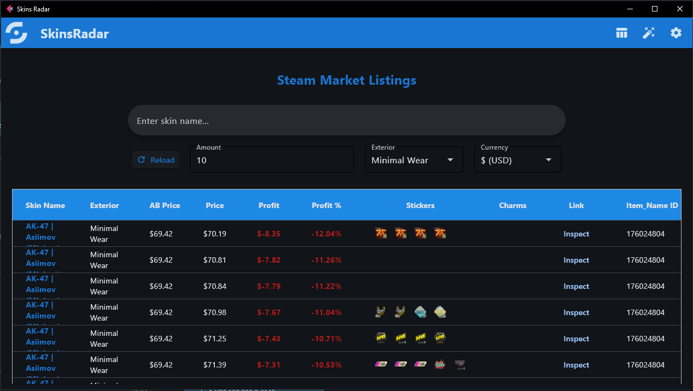
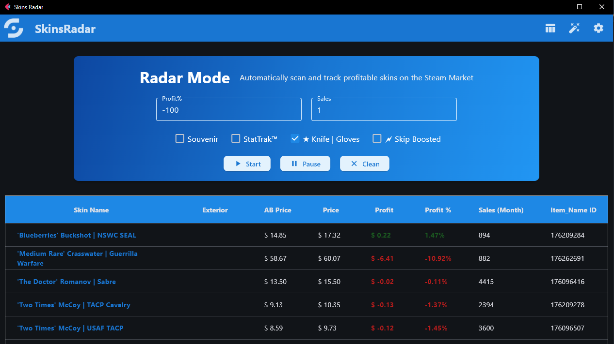
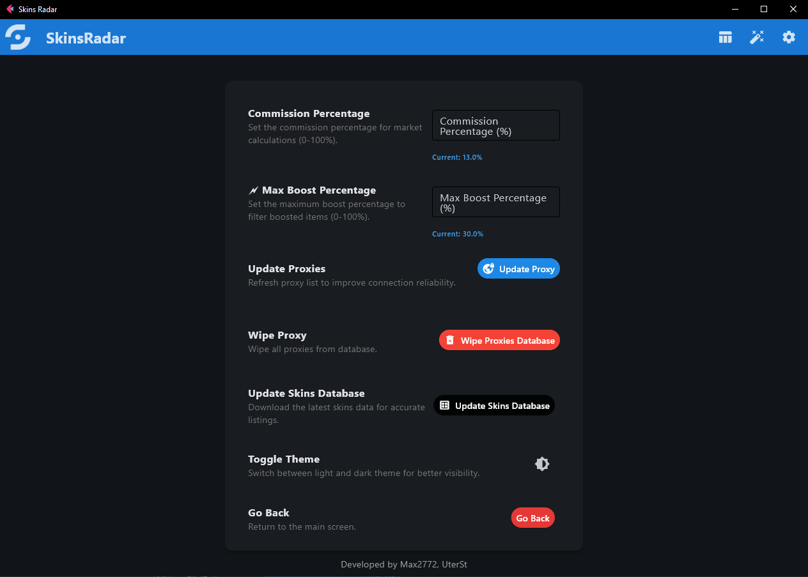

# SkinsRadar
## [➡ English ReadMe](../README.md)


SkinsRadar — это мощный инструмент для мониторинга скинов CS2 на [steamcommunity.com](https://steamcommunity.com) 🚀. Он позволяет отслеживать и анализировать цены на скины, обходить ограничения Steam на количество запросов с помощью прокси (**❗ Только socks4:// socks5://**) и находить выгодные предложения для перепродажи или других целей. **Регистрация или вход в аккаунт не требуются** 🔑 — начинайте сразу!

С двумя основными режимами — **Режим Радар** ⚡ для быстрого сканирования всех предметов CS2 и **Режим Браузер** 📊 для детального изучения конкретных предметов — SkinsRadar идеально подходит для активных трейдеров, покупателей или тех, кто хочет обойти ограничения Steam при частом просмотре в браузере.

## ✨ Возможности

- **Режим Радар** ⚡:
  - Быстрое сканирование всех скинов и предметов CS2 для поиска выгодных предложений с настраиваемыми параметрами:
    - 💰 Процент прибыли (с учётом комиссии Steam, по умолчанию 13.0%).
    - 📈 Объём продаж за месяц.
    - 🗂️ Фильтрация по группам (например, Souvenir, StatTrak™, ★ Knife | Gloves).
    - 🗲 Пропуск забущенных предметов с настраиваемым процентом забущенности (по умолчанию 30.0%).
- **Режим Браузер** 📊:
  - Просмотр более **23 000 предметов CS2** с детальными лотами:
    - 🔍 Просмотр всех лотов, включая стикеры и брелки (Charms) для скинов.
    - 🎨 Фильтрация по износу (Exterior), количеству лотов (Amount) и валюте.
    - 💸 Мгновенный расчёт процента прибыли по сравнению с ценой автобая.
- **Управление прокси** 🌐:
  - Добавление прокси через текстовые файлы, хранение в базе данных и ротация для обхода ограничений Steam.
- **Поддержка валют** 💱:
  - Поддержка ~40 валют Steam в Режиме Браузер; Режим Радар использует USD.
- **Настройки** ⚙️:
  - 💸 Настройка комиссии Steam (по умолчанию 13.0%).
  - 🗲 Установка максимального процента забущенности (по умолчанию 30.0%).
  - 📂 Добавление прокси через проводник (кнопка `Update Proxy`).
  - 🗑️ Очистка базы данных прокси (кнопка `Wipe Proxies Database`).
  - 🗄️ Обновление или создание базы данных предметов CS2 (кнопка `Update Skins Database`).
  - 🌙 Переключение между тёмной и светлой темами (по умолчанию — системная тема).
- **Без регистрации** 🔓:
  - Доступ ко всем функциям без необходимости в аккаунте Steam или API-ключе.
- **Логирование** 📜:
  - Настраиваемое логирование для отладки с выбором языка (`--lang=ru` или `--lang=en`) и уровней логов (`DEBUG`, `INFO` и т.д.).

## 🛠️ Установка

SkinsRadar требует **Python 3.12** для оптимальной работы (другие версии не тестировались) 🐍.

1. **Клонируйте репозиторий**:
   ```bash
   git clone https://github.com/Max2772/SkinsRadar.git
   cd SkinsRadar
   ```
2. **Установите зависимости**:
   ```bash
   pip install -r requirements.txt
   ```
3. **Настройте прокси** (опционально) 🌐:
   - Используйте кнопку `Update Proxy` для добавления прокси из текстового файла.
   - Приложение автоматически отфильтрует рабочие прокси и исключит дубликаты.
4. **Инициализируйте базу скинов** (опционально) 🗄️:
   - Используйте кнопку `Update Skins Database` для создания или обновления базы данных предметов CS2.

> **Примечание**: Готовые исполняемые файлы для **Windows** и **Linux** доступны в директории `build/` 📦.

### Зависимости 📋
- Python 3.12
- `flet==0.28.3`
- `httpx==0.28.1`
- `httpx_socks==0.10.1`
- `aiosqlite==0.21.0`
- `aiofiles==24.1.0`
- `tqdm==4.67.1`
- `fuzzywuzzy==0.18.0`
- `python-Levenshtein==0.27.1`
- `tzdata==2025.2`

Полный список см. в `requirements.txt`.

## 🚀 Использование

### Запуск приложения
- **Через Python**:
   ```bash
   python3 main.py
   ```
   Дополнительные аргументы:
   - `--lang=ru` или `--lang=en`: Установка языка логов в терминале (русский или английский).
   - `--log-level=DEBUG|INFO|WARNING|WARN|ERROR|FATAL|CRITICAL`: Настройка уровня логов.

- **Через готовые сборки**:
   - Используйте исполняемые файлы в директории `build/` для Windows или Linux.

### Пример работы
1. **Запустите приложение**:
   ```bash
   python3 main.py --lang=ru --log-level=INFO
   ```
2. **Режим Радар** ⚡:
   - Установите процент прибыли, объём продаж и группы предметов.
   - Включите 🗲 Пропуск забущенных предметов (по умолчанию 30.0%).
   - Сканируйте выгодные предметы CS2.
3. **Режим Браузер** 📊:
   - Выберите предмет из более чем 23 000 предметов CS2.
   - Фильтруйте по износу, количеству лотов и валюте.
   - Просматривайте проценты прибыли и детали лотов (стикеры, брелки).
4. **Настройки** ⚙️:
   - Настройте комиссию Steam или тему приложения.
   - Добавьте прокси через `Update Proxy` или обновите базу данных скинов с помощью `Update Skins Database`.

## 📸 Скриншоты и Логи

### Скриншоты 🖼️
Ниже приведены скриншоты для основных окон SkinsRadar.

- **Режим Браузер**:
  
  *Просмотр детальных лотов более 23 000 предметов CS2 с фильтрами по износу, количеству лотов и валюте.*

- **Режим Радар**:
  
  *Быстрое сканирование всех предметов CS2 для поиска выгодных предложений с настраиваемыми фильтрами.*

- **Настройки**:
  
  *Настройка комиссии Steam, управления прокси, обновления базы данных и темы приложения.*

### Примеры логов 📜
SkinsRadar предоставляет подробные логи для отладки и мониторинга. Ниже приведены примеры логов для **Режима Браузер** и **Режима Радар**.

#### Логи Режима Браузер
```log
2025-07-22 16:00:10,809 - [MainProcess] INFO - main.fetch_market_data:103 - Запрос к https://steamcommunity.com/market/listings/730/AK-47%20%7C%20Asiimov%20(Minimal Wear)/render?start=0&count=10¤cy=1&format=json
2025-07-22 16:00:16,354 - [MainProcess] INFO - main.fetch_market_data:106 - Успешный ответ от https://steamcommunity.com/market/listings/730/AK-47%20%7C%20Asiimov%20(Minimal Wear)/render?start=0&count=10¤cy=1&format=json
2025-07-22 16:00:17,104 - [MainProcess] INFO - main.get_autobuy_data:52 - Запрос к https://steamcommunity.com/market/itemordershistogram?norender=1&country=NL&language=english¤cy=1&item_nameid=176024804&two_factor=0
2025-07-22 16:00:17,104 - [MainProcess] INFO - main.get_autobuy_data:54 - Успешный ответ от https://steamcommunity.com/market/itemordershistogram?norender=1&country=NL&language=english¤cy=1&item_nameid=176024804&two_factor=0
```

#### Логи Режима Радар
```log
2025-07-22 16:03:23,022 - [MainProcess] INFO - handlers.start_parsing:242 - Режим Радар запущен
2025-07-22 16:03:23,026 - [MainProcess] INFO - proxies_manager.get_random_proxy:102 - Выбран случайный прокси: socks4://98.175.31.195:4145
2025-07-22 16:03:23,033 - [MainProcess] INFO - skins_manager.get_item_autosearch:147 - Выбран предмет: name=AK-47 | Baroque Purple (Minimal Wear), item_nameid=176096521
2025-07-22 16:03:24,804 - [MainProcess] INFO - main.get_autobuy_data:52 - Запрос к https://steamcommunity.com/market/itemordershistogram?norender=1&country=NL&language=english¤cy=1&item_nameid=176096521&two_factor=0
2025-07-22 16:03:24,804 - [MainProcess] INFO - main.get_autobuy_data:54 - Успешный ответ от https://steamcommunity.com/market/itemordershistogram?norender=1&country=NL&language=english¤cy=1&item_nameid=176096521&two_factor=0
2025-07-22 16:03:26,027 - [MainProcess] INFO - main.get_history_data:76 - Запрос к https://steamcommunity.com/market/listings/730/AK-47 | Baroque Purple (Minimal Wear)
2025-07-22 16:03:26,027 - [MainProcess] INFO - main.get_history_data:78 - Успешный ответ от https://steamcommunity.com/market/listings/730/AK-47 | Baroque Purple (Minimal Wear)
2025-07-22 16:03:26,032 - [MainProcess] INFO - main.get_history_data:81 - Предмет пропущен из-за забущенности
2025-07-22 16:03:26,032 - [MainProcess] INFO - handlers.start_parsing:273 - Предмет не добавлен в AutoTable из-за забущенности
2025-07-22 16:03:27,042 - [MainProcess] INFO - skins_manager.get_item_autosearch:147 - Выбран предмет: name=AK-47 | Baroque Purple (Well-Worn), item_nameid=176096413
2025-07-22 16:03:27,790 - [MainProcess] INFO - main.get_autobuy_data:52 - Запрос к https://steamcommunity.com/market/itemordershistogram?norender=1&country=NL&language=english¤cy=1&item_nameid=176096413&two_factor=0
2025-07-22 16:03:27,790 - [MainProcess] INFO - main.get_autobuy_data:54 - Успешный ответ от https://steamcommunity.com/market/itemordershistogram?norender=1&country=NL&language=english¤cy=1&item_nameid=176096413&two_factor=0
2025-07-22 16:03:28,875 - [MainProcess] INFO - main.get_history_data:76 - Запрос к https://steamcommunity.com/market/listings/730/AK-47 | Baroque Purple (Well-Worn)
2025-07-22 16:03:28,875 - [MainProcess] INFO - main.get_history_data:78 - Успешный ответ от https://steamcommunity.com/market/listings/730/AK-47 | Baroque Purple (Well-Worn)
2025-07-22 16:03:28,878 - [MainProcess] INFO - main.process_autosearch_json_to_data:227 - Разница -12.535380507343131% < 5.0%, предмет пропущен
2025-07-22 16:03:28,879 - [MainProcess] INFO - handlers.start_parsing:271 - Предмет не добавлен в AutoTable из-за фильтрации
2025-07-22 16:03:29,882 - [MainProcess] INFO - skins_manager.get_item_autosearch:147 - Выбран предмет: name=AK-47 | Black Laminate (Battle-Scarred), item_nameid=1321650
2025-07-22 16:03:30,653 - [MainProcess] INFO - main.get_autobuy_data:52 - Запрос к https://steamcommunity.com/market/itemordershistogram?norender=1&country=NL&language=english¤cy=1&item_nameid=1321650&two_factor=0
2025-07-22 16:03:30,654 - [MainProcess] INFO - main.get_autobuy_data:54 - Успешный ответ от https://steamcommunity.com/market/itemordershistogram?norender=1&country=NL&language=english¤cy=1&item_nameid=1321650&two_factor=0
2025-07-22 16:03:32,060 - [MainProcess] INFO - main.get_history_data:76 - Запрос к https://steamcommunity.com/market/listings/730/AK-47 | Black Laminate (Battle-Scarred)
2025-07-22 16:03:32,060 - [MainProcess] INFO - main.get_history_data:78 - Успешный ответ от https://steamcommunity.com/market/listings/730/AK-47 | Black Laminate (Battle-Scarred)
2025-07-22 16:03:32,066 - [MainProcess] INFO - handlers.start_parsing:276 - Новая строка добавлена в AutoTable
2025-07-22 16:03:33,082 - [MainProcess] INFO - skins_manager.get_item_autosearch:147 - Выбран предмет: name=AK-47 | Black Laminate (Factory New), item_nameid=1340331
2025-07-22 16:03:33,450 - [MainProcess] INFO - handlers.pause_auto_parsing:302 - Режим Радар приостановлен
```

## ⚠️ Отказ от ответственности

SkinsRadar не связан со Steam, Valve или разработчиками CS2. Это независимый проект, созданный третьей стороной, и он не поддерживается, не спонсируется и не одобряется Steam или Valve. Все вопросы, связанные со Steam или CS2, следует направлять непосредственно в компанию Valve. Вы несёте ответственность за то, чтобы использование SkinsRadar соответствовало всем применимым законам и нормативным требованиям. Разработчик не поощряет и не поддерживает какое-либо незаконное использование данного программного обеспечения.

## 📜 Лицензия

Проект распространяется под лицензией **MIT**. Подробности см. в файле [LICENSE](LICENSE).

## 🤝 Внесение вклада

Мы приветствуем любые улучшения! 🎉 Чтобы внести вклад:
1. Сделайте форк репозитория.
2. Создайте новую ветку (`git checkout -b feature/AmazingFeature`).
3. Внесите изменения и закоммитьте их (`git commit -m 'Add some AmazingFeature'`).
4. Отправьте изменения в ваш форк (`git push origin feature/AmazingFeature`).
5. Создайте Pull Request.

## 📬 Контакты

Есть вопросы или предложения? Свяжитесь через:
- **Email**: [bib.maxim@gmail.com](mailto:bib.maxim@gmail.com)
- **GitHub Issues**: [Создать Issue](https://github.com/Max2772/SkinsRadar/issues)
